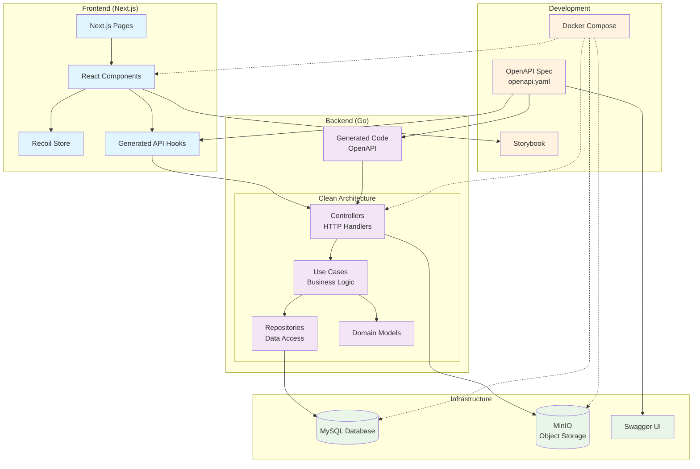

# FinanSu

FinanSuは、NUTFes/NUTMegの財務管理システムです。OpenAPI駆動開発により、Go + Next.jsで構築されています。

## 技術スタック (Tech Stack)

### Backend (API)
- **Language**: Go 1.23+ with Echo framework
- **Database**: MySQL 8.0 + GORM
- **Storage**: MinIO (S3-compatible)
- **Code Generation**: oapi-codegen (OpenAPI)
- **Testing**: Go test with testfixtures

### Frontend (View)
- **Framework**: Next.js 14 + React 18 + TypeScript
- **UI**: Chakra UI + Tailwind CSS
- **State Management**: Recoil with persistence
- **Data Fetching**: SWR with generated hooks
- **Code Generation**: Orval (OpenAPI to TypeScript)

### Infrastructure
- **Container**: Docker + Docker Compose
- **Development**: Hot reload with Air (Go) + Next.js dev server
- **API Documentation**: Swagger UI

## 環境構築 (set up)

### 基本セットアップ
```bash
make run-db      # データベース起動 (MySQL + MinIO)
make build       # アプリケーションビルド
make run         # アプリケーション起動
```

### 全て一括起動
```bash
make run-all     # DB + アプリ + Swagger UI
```

### 直接Docker Composeを使用する場合
```bash
docker compose -f compose.db.yml up -d
docker compose build
docker compose up
```

## 開発コマンド (Development Commands)

### コード生成 (重要)
```bash
make gen         # OpenAPI仕様からAPI/フロントエンドコード生成
make gen-api     # Go serverコード生成
make gen-front-api # TypeScript hooks生成
```

### テスト・品質チェック
```bash
make run-test    # Go APIテスト実行
make run-eslint  # フロントエンドLint実行
make format      # コードフォーマット
```

### その他の便利コマンド
```bash
make run-sb      # Storybook起動
make ent-db      # MySQLシェルへ接続
make run-swagger # Swagger UI起動
make seed        # データベースシード実行
```

## 開発環境詳細

### ポート設定
- **Frontend**: http://localhost:3000
- **API**: http://localhost:1323
- **Database**: localhost:3306
- **MinIO Console**: http://localhost:9001
- **Storybook**: http://localhost:6006

### システム設計図



### アーキテクチャの特徴

1. **OpenAPI駆動開発**: 全ての型安全性がOpenAPI仕様から生成
2. **Clean Architecture**: バックエンドは依存関係逆転により保守性を確保
3. **型安全性**: フロントエンドからバックエンドまで一貫した型チェック
4. **コンテナ化**: Docker Composeによる一貫した開発環境

### プロジェクト構造
```
/api/               # Go backend (Clean Architecture)
  ├── main.go       # エントリーポイント
  ├── drivers/      # インフラ層 (DB, MinIO, server)
  ├── externals/    # コントローラー・リポジトリ
  ├── internals/    # ドメイン・ユースケース
  └── generated/    # OpenAPI自動生成コード

/view/next-project/ # Next.js frontend
  ├── src/components/   # 機能別Reactコンポーネント
  ├── src/pages/        # Next.js file-based routing
  ├── src/generated/    # 自動生成APIフック
  └── src/store/        # Recoil状態管理

/openapi/           # OpenAPI仕様 (真の情報源)
/mysql/db/          # データベーススキーマ・マイグレーション
```

## 開発ワークフロー

### OpenAPI駆動開発
1. `/openapi/openapi.yaml` を編集してAPI変更
2. `make gen` でGo serverコードとTypeScript hooksを再生成
3. サーバーサイドロジックをcontrollers/use casesで実装
4. 生成されたhooksをReactコンポーネントで使用

### 環境管理
- **開発**: `compose.yml`
- **ステージング**: `compose.stg.yml`
- **本番**: `compose.prod.yml`
- **DB のみ**: `compose.db.yml`

## ドキュメント (Documents)

### プロジェクト概要
- [FinanSu について](https://www.notion.so/nutfes-nutmeg/FinanSu-6f207506947b475aad3610210016a8a3) - 背景・目的や技術仕様
- [FinanSu 開発ガイド](https://www.notion.so/nutfes-nutmeg/FinanSu-OK-3a12e725374742608959b6bac61d702c) - 開発全般の情報

### 開発ルール
- [Git ワークフロー](https://www.notion.so/nutfes-nutmeg/git-clone-41a4a1a2df324c92a56b6d0b1b244747) - 開発時のGit使用手順
- [Git/GitHub 基本操作](https://www.notion.so/nutfes-nutmeg/Git-Github-478cabf96e3e44909e35b3476fe08886)
- [ブランチルール](https://www.notion.so/nutfes-nutmeg/9d1646b47e184ab1b85b35e02de76e3f)
- [コミットルール](https://www.notion.so/nutfes-nutmeg/f4ace67ac1c14d849aee084327914c0f)

### API・技術仕様
- [API 一覧](https://www.notion.so/nutfes-nutmeg/FinanSu-API-92b657ec9ff64157be94486fbfc8382f)
- [OpenAPI 仕様書](http://localhost:1323/swagger/index.html) - 開発中にアクセス可能
- [Storybook](http://localhost:6006) - コンポーネントドキュメント

### 関連記事
- [FinanSu タグ記事一覧](https://www.notion.so/nutfes-nutmeg/FinanSu-db5914909df34786b7f1e4a205ebfea7)

## AI 開発支援

このプロジェクトは AI アシスタント（Claude Code、GitHub Copilot）による開発を支援しています。

- **CLAUDE.md** - Claude Code 用の開発ガイダンス
- **GitHub Copilot** - カスタム指示付きコード支援（日本語ITギャル設定）

## 重要な注意事項

### コード生成の依存関係
- OpenAPI仕様を変更したら必ず `make gen` を実行
- 生成されたコードは手動で編集しない
- 型安全性はOpenAPI仕様からバックエンド・フロントエンドに流れる

### 品質管理
- フロントエンドコミット前に `make run-eslint` と `make format` を実行
- APIテストは `make run-test` で実行
- PRは `.github/pull_request_template.md` テンプレートを使用
